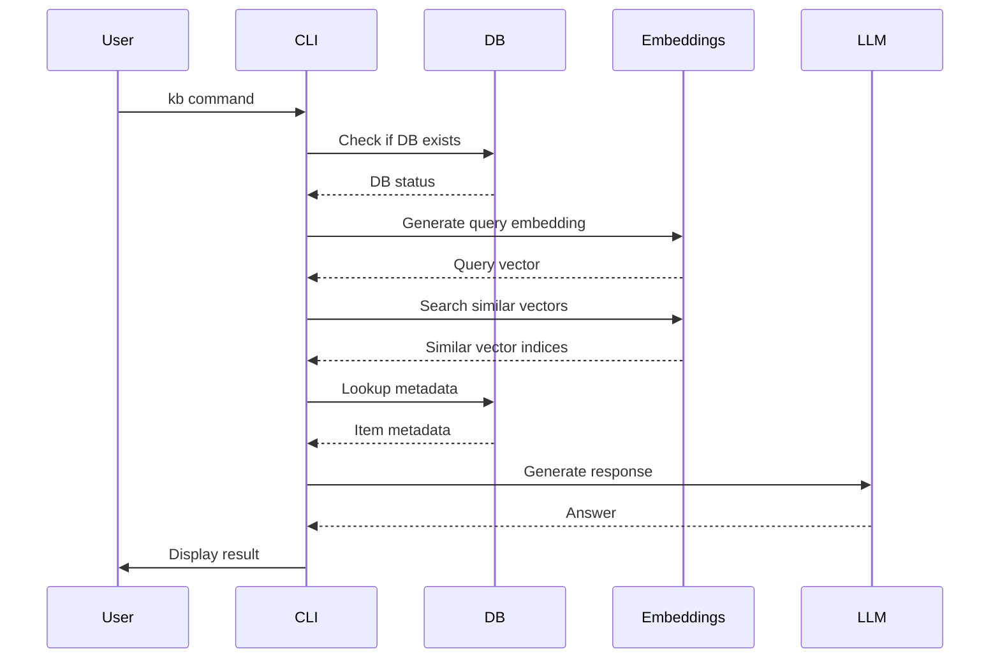

# Knowledgebase Semantic Search

A modular semantic search implementation using FAISS for vector storage, SQLite for metadata, and OpenAI embeddings. Allows for creating and searching through a knowledgebase (kb)

## Features

- Modular architecture with clear separation of concerns
- Ingest data from JSON files into SQLite database
- Generate embeddings using OpenAI's text-embedding-3-small model
- Store and search vectors using FAISS with direct mapping to SQLite records
- Semantic search with k-nearest neighbors
- LLM-powered answer generation using OpenRouter

## Setup

1. Install the package:
```bash
pip install -e .
```

2. Rename the `.env-example` file to `.env` file and add your API keys:

## Usage

The system provides several CLI commands through the `kb` command:

1. Ingest data:
Imports data from the nominated json file to the sqlite database.

```bash
kb ingest-data data.json
```

1. Generate embeddings:
Iterates through each item in the database and submits them to Openai's embedding api

```bash
kb embed-items
```

1. Run a search:
```bash
kb search "your search query here"
```

## Architecture

The system is organized into several modules:

```mermaid
graph TD
    A[Terminal: 'kb' command] --> B[Entry Point: main()]
    B --> C[Click CLI Group]
    C --> D[ingest-data command]
    C --> E[embed-items command]
    C --> F[search command]
    D --> G[database.py]
    E --> H[embeddings.py]
    F --> I[llm.py]
    G --> J[SQLite DB]
    H --> K[FAISS Index]
    I --> L[OpenRouter API]
```

### Modules

- `config.py`: Configuration and environment variables
- `database.py`: SQLite database operations
- `embeddings.py`: Vector operations and FAISS index management
- `llm.py`: LLM prompt handling and API calls
- `cli.py`: Command-line interface


## Command Flow

When you run a command, here's what happens:



## Data Format

The input JSON file should follow this schema:
```json
[
    {
        "id": "unique_id",
        "content": "text content to search",
        "author": "content author",
        "action_type": "how item was acquired",
        "created_at": "original creation timestamp",
        "acquired_at": "when item was added to database"
    }
]
```

## Files

- `src/`: Main package directory containing all modules
  - `__init__.py`: Package initialization
  - `cli.py`: Command-line interface
  - `config.py`: Configuration settings
  - `database.py`: Database operations
  - `embeddings.py`: Vector operations
  - `llm.py`: LLM interactions
- `query_prompt.md`: Prompt template for LLM
- `knowledge.db`: SQLite database with items and their vector indices
- `vectors.faiss`: FAISS vector index with 1:1 mapping to database records

## Implementation Details

The system maintains a direct 1:1 mapping between FAISS vector indices and SQLite records using a `vector_index` column in the database. This ensures that item N in the FAISS index corresponds exactly to the database record with `vector_index=N`.

Here's how it works:

1. During data ingestion:
   - Each item is assigned a sequential `vector_index` (0, 1, 2, etc.)
   - This index is stored in the SQLite database alongside the item's metadata

2. During embedding generation:
   - Items are retrieved from SQLite in `vector_index` order
   - Embeddings are added to FAISS in the same order
   - This maintains the 1:1 correspondence between FAISS and SQLite indices

3. During search:
   - FAISS returns indices of similar vectors
   - These indices directly correspond to the `vector_index` values in SQLite
   - Metadata can be retrieved without any additional mapping step 